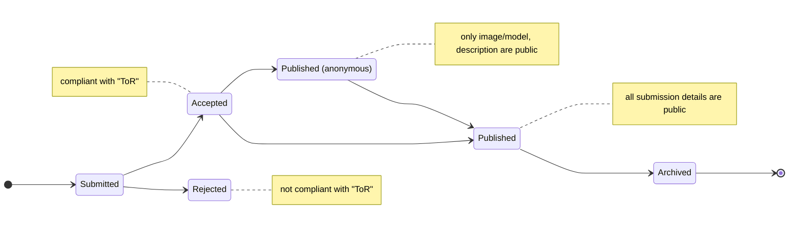
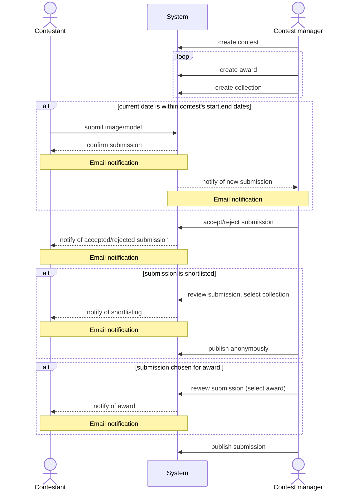
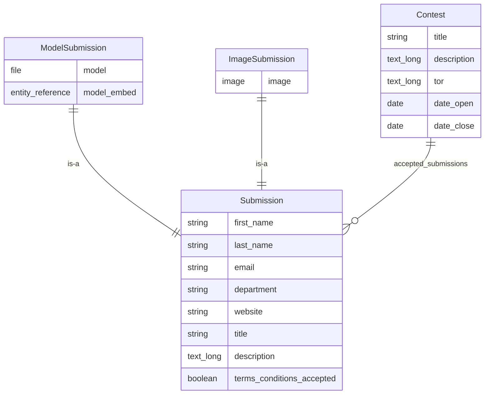

# unb-libraries/lib.unb.ca/ior
This module lets eligible participants submit contributions to [Image of Research](https://lib.unb.ca/researchcommons/ior) contests and allows contest administrators to manage contests, as well as review submissions.

## Installation
If not enable already, shell into the application container and enable the ```ior``` and ```ior_awards``` modules
```sh
dockworker shell:local
drush en ior,ior_awards
```
or, using the Drupal admin UI, navigate to ```/admin/modules``` and select the **_"Images of Research"_** and **_"Images of Research Awards"_** modules, then click "Install".

## Usage

The following are core use cases for IOR users and administrators:

### Creating new contests
In order for contestants, to submit images, a contest has to be created. To do so, log in as a user with the ```ior_manager``` role, visit ```/researchcommons/ior/contests/add```. Enter a contest _name_, _description_, _Terms of Reference_, choose a submission type (either _Image_ or _3D Model_) and define an opening and closing date within which submission shall be accepted. Submit the form.

Contests will automatically accept entries within the configured open and close dates and will deny submissions outside of this range.

### Entering submissions
From the contest overview page, find a contest and follow its link to see its details. If the contest is open for submissions (the current date is within the contest's start and end date), you will see a button to submit an image or model. Click the button and enter your submission details into the form.

### Moderating submissions
From a contest page, follow the "view submissions" link to see all submissions that can be moderated. Choose one by clicking on its title or image, then pick the "Moderate" tab. Change the submission's state, then click save.

The following illustrates the moderation flow:


The possibility of publishing anonymised submission is intended to provide (external) judges the opportunity to review submissions without giving away any information that may implicate the review process by identifying participants.

The possibility of archiving submissions was requested, but its purpose and implications on the system status has been never clearly defined.

### Assigning Awards, Collections
From a contest page, follow the "view submissions" link to see all submissions that can be reviewed. Choose one by clicking on its title or image, then pick the "Review" tab. Select all applicable collections and/or awards and click "Submit".

The following illustrates the interactions between contest manager, contestants and the ```ior``` module curing the life cycle of a contest:



## Implementation details

### Data Model
The data model is implemented using a combination of custom entities and Drupal's Field UI. Main entry points are the [```Drupal\ior\Entity\Submission```](../custom/modules/ior/src/Entity/Submission.php) and [```Drupal\ior\Entity\Contest```](../custom/modules/ior/src/Entity/Contest.php) classes.



### Caching
Caching is disabled for [```entity.ior_submission.add_form```](../custom/modules/ior/src/Entity/Routing/SubmissionHtmlRouteProvider.php) and [```entity.contest.canonical```](../custom/modules/ior/src/Entity/Routing/ContestHtmlRouteProvider.php) routes. This is to prevent (not) accepting submissions inside or outside a contest's open/close dates, as well as users (not) being able to navigate to a (non-)existing form due to caching.

### Access control
The [```Drupal\ior\Entity\Access\SubmissionAccessControlHandler```](../custom/modules/ior/src/Entity/Access/SubmissionAccessControlHandler.php) extends default access control by accounting for a ```ior_submission``` entity's moderation state.

### Submission view filter
The [```Drupal\ior\Plugin\views\filter\ModerationStatePermissionFilter```](../custom/modules/ior/src/Plugin/views/filter/ModerationStatePermissionFilter.php) plugin filters the submissions view based on submissions' moderation state.

### Email handlers
The [```Drupal\ior\EventSubscriber\ContestantMailer```](../custom/modules/ior/src/EventSubscriber/ContestantMailer.php) and [```Drupal\ior\EventSubscriber\ContestManagerMailer```](../custom/modules/ior/src/EventSubscriber/ContestManagerMailer.php) send email notifications to contestants and contest managers upon submission creation and update.

### Contest path alias
Custom path aliases for ```contest``` entities are [created upon entity creation](../custom/modules/ior/ior.module).

## Testing
The module does not include automated tests. In order to verify its behaviour, follow the usage instructions.


