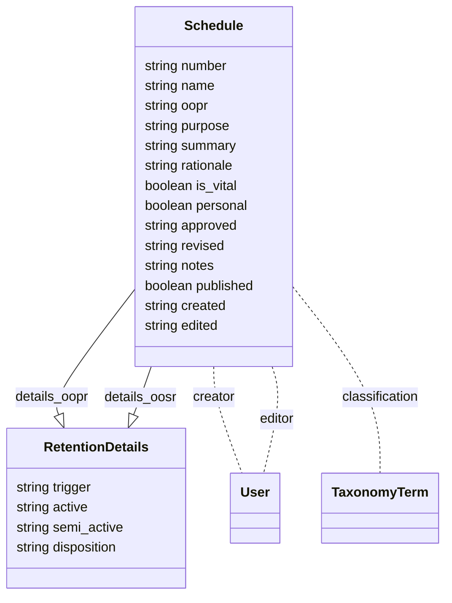

# unb-libraries/lib.unb.ca/records-management
This module allows for administering [UNB Retention Schedules](https://lib.unb.ca/records) as well as an interface to browse and search those schedules.

## Usage
In order to create a retention schedule, log in as a user with the ```records_manager``` role, then navigate to ```/records/schedules/add```. Fill and submit the form (make sure the "Classification (Records Management)" has terms or add some by navigating to ```/admin/structure/taxonomy/manage/retention_classification/add```), then find your schedule listed at ```/records/schedules```.

## Implementation details

### Data Model


Retention schedules are defined by the ```Drupal\records_management\Entity\Schedule``` entity class. Please note, that the ```revised``` field does not indicate a Drupal revision, but a "real-world" revised version of the schedule.

### Permission filter
The view that renders the schedule list at ```/records``` features a [```ViewsFilter``` plugin](../custom/modules/records_management/src/Plugin/views/filter/UnpublishedPermissionFilter.php), which hides unpublished schedule entities from users without the necessary permission to view those.

### Sample dataset


## Testing
The module does not include automated tests. In order to verify its behaviour, follow the usage instructions.


